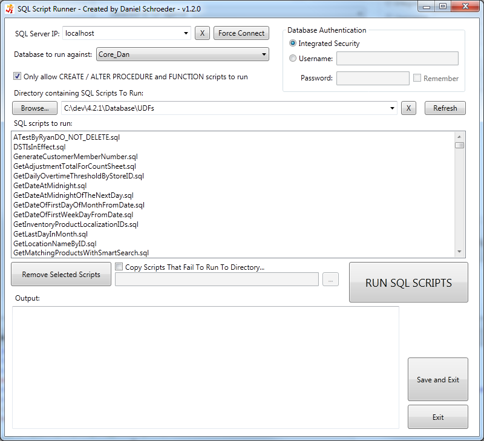

# SQL Script Runner Description

SQL Script Runner is a lightweight program that can be used to quickly run multiple SQL scripts against a database.  If you have all of your Stored Procedures, 

One key feature of SQL Runner is that it will automatically change any CREATE statements to ALTER statements, without modifying the actual file.  For example, you may have a folder full of stored procedures that all begin with "CREATE PROCEDURE".  If the script fails to run, SQL Runner will change it to "ALTER PROCEDURE" in order for the scripts to run successfully.

